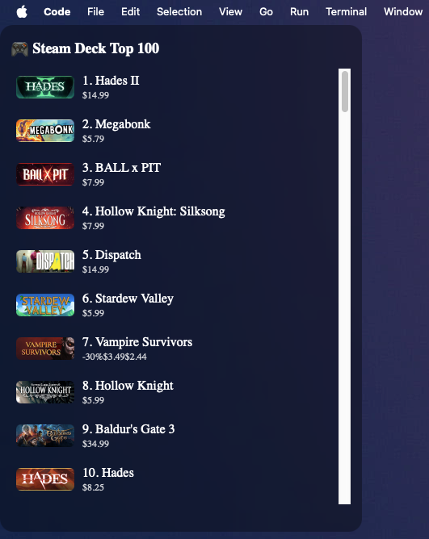

# 🎮 Steam Deck Top 100 Widget for macOS

Display the **most played games on Steam Deck** live on your macOS desktop!  

This project fetches data from Steam's [Top Played on Deck](https://store.steampowered.com/charts/steamdecktopplayed) page and displays it as an **Übersicht** widget.



---

## ✨ Features

- 🧩 Real-time Steam Deck Top 100 list  

- 🎨 Modern design with game names, prices, and cover art  

- 🖱️ Scrollable full list  

- 🌈 Blur effect transparent interface  

- ⚙️ Auto-refresh (every hour)  

---

## 🧰 Requirements

- macOS Monterey or later  

- [Übersicht](https://tracesof.net/uebersicht/) installed  

- [Homebrew](https://brew.sh/) (recommended for Python)  

- Python 3.10+  

---

## 🚀 Installation Steps

### 1️⃣ Clone the repository

```bash
git clone https://github.com/mertefekurt/DeckTop100.git
cd DeckTop100
```

---

### 2️⃣ Set up Python environment

```bash
# Create virtual environment
python3 -m venv venv
source venv/bin/activate

# Install required libraries
pip install playwright beautifulsoup4
playwright install
```

🔹 This step downloads Playwright (for browser automation)  
🔹 `beautifulsoup4` is for HTML parsing operations

---

### 3️⃣ Fetch the data

```bash
python sd.py
```

This command opens the Steam Deck page, extracts the class map, and creates the `steamdeck_top.json` file.

**File:** `DeckTop100/steamdeck_top.json`

Contains data for 100 games in JSON format:

```json
{
  "rank": "1",
  "name": "Hades II",
  "price": "$14.99",
  "change": "▲ 1",
  "url": "https://store.steampowered.com/app/1145350/Hades_II/",
  "image": "https://cdn.akamai.steamstatic.com/steam/apps/1145350/capsule_184x69.jpg"
}
```

---

### 4️⃣ Install Übersicht Widget

1. **Download Übersicht** → https://tracesof.net/uebersicht/

2. **Find the Widgets Folder:**
   - Open Übersicht → Preferences → Widgets Folder
   - Usually located at:
     ```
     ~/Library/Application Support/Übersicht/widgets
     ```

3. **Create new widget folder:**
   ```bash
   mkdir -p ~/Library/Application\ Support/Übersicht/widgets/steamdeck.widget
   ```

4. **Copy `index.jsx` to the widget folder:**
   ```bash
   cp index.jsx ~/Library/Application\ Support/Übersicht/widgets/steamdeck.widget/
   ```

---

### 5️⃣ Update the file path

Find this line in `index.jsx`:

```jsx
export const command = "cat /Users/YourUser/Documents/Projects/DeckTop100/steamdeck_top.json";
```

Update it with your username:

```jsx
export const command = "cat /Users/<your_username>/Documents/Projects/DeckTop100/steamdeck_top.json";
```

---

### 6️⃣ Restart Übersicht

```bash
killall Übersicht
open -a Übersicht
```

Now you should see 🎮 **Steam Deck Top 100** on your desktop!

You can scroll through all the games 👇

---

## 💾 (Optional) Auto-Update

To automatically fetch the list every hour, add a cron job:

```bash
crontab -e
```

Add this line:

```bash
0 * * * * cd /Users/<your_username>/Documents/Projects/DeckTop100 && /Users/<your_username>/Documents/Projects/DeckTop100/venv/bin/python sd.py
```

---

## 📖 How It Works

**The Core Widget (`index.jsx`):**
- This is the main Übersicht widget file
- Reads `steamdeck_top.json` and displays it on your desktop
- Auto-refreshes every hour (configurable)
- Works independently - you only need Übersicht and this file!

**The Scraper (`sd.py`):**
- Optional helper script to fetch data from Steam
- Uses Playwright to scrape the Steam Deck Top Played page
- Extracts CSS class mappings from webpack chunks
- Parses HTML and saves to `steamdeck_top.json`
- You can use any method to create/update the JSON file

---

## 🔧 Configuration

### Customize refresh interval

Edit `index.jsx` line 1:

```jsx
export const refreshFrequency = 1000 * 60 * 60; // 1 hour in milliseconds
```

### Customize widget appearance

Edit styles in `index.jsx`:
- Width/Height: lines 19-20
- Colors: line 17 (text), line 21 (background)
- Font: line 16

---

## ⚠️ Troubleshooting

**Widget shows "Loading..." or error:**
- Verify the file path in `index.jsx` matches your actual path
- Ensure `steamdeck_top.json` exists and is valid JSON
- Check that Übersicht has permission to read the file

**Scraper fails:**
- Steam may have changed their page structure - check if the class mappings are still valid
- Ensure Chromium is installed: `playwright install chromium`
- Try running with visible browser: change `headless=True` to `headless=False` in `sd.py`

**No data showing:**
- Run `python sd.py` to generate the JSON file
- Check that the JSON file is not empty
- Verify file permissions

---

## 🧠 Contributing

Pull requests and issues are always welcome ❤️

Share your feature ideas here!

---

---

## 🔗 Links

- [Steam Deck Top Played](https://store.steampowered.com/charts/steamdecktopplayed)
- [Übersicht Widgets](https://tracesof.net/uebersicht/)
- [Playwright Documentation](https://playwright.dev/python/)
